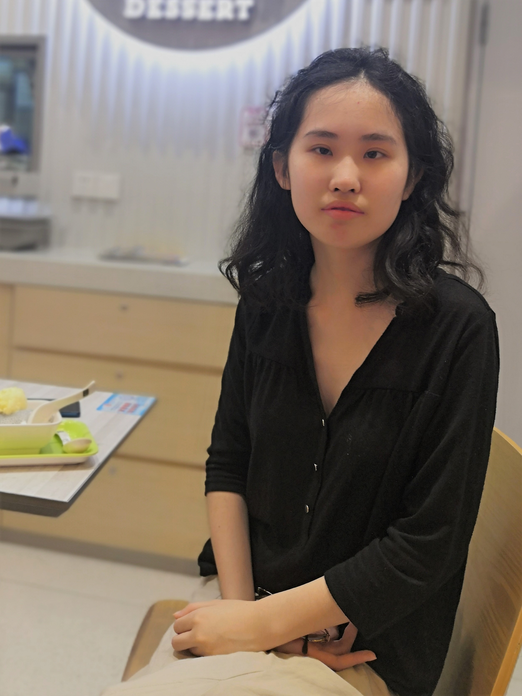

#Pronouns: she, her, hers#

**Email:** xinyuevikchen[at]eecs.berkeley.edu

**Links:** [[Google Scholar](https://scholar.google.com/citations?pli=1&authuser=1&user=s67FB6cAAAAJ)] [[GitHub](https://github.com/lanyavik)]

**Curriculum Vitae:** [updating] .

## About me

Hi! I am Xinyue Chen, a CS graduate student at [UC Berkeley](https://bair.berkeley.edu/) working with Prof. [Pieter Abbeel](https://people.eecs.berkeley.edu/~pabbeel/). 
During my undergraduate studies, I was fortunate to be advised by Prof. [Keith Ross](https://sites.google.com/nyu.edu/keithross/) of NYU and Prof. [Xiaolong Wang](https://xiaolonw.github.io/) of UCSD.
My current research is on Reinforcement Learning and its applications. I am also broadly interested in topics like Representation Learning, Vision and Robotics.

## Education
* B. Sc. in Computer Science, New York University Shanghai, September 2018 ~ June 2022. [Graduated with Dean's Award in Computer Science, Data Science, and Engineering (top-1 honor in the department)]
* Ph. D. in Computer Science, University of California, Berkeley. August 2022 ~ Present.

## Publications
* [Randomized Ensembled Double Q-Learning: Learning Fast Without a Model](https://arxiv.org/abs/2101.05982). **Xinyue Chen**\*, Che Wang\*, Zijian Zhou\*, Keith Ross. International Conference on Learning Representations (ICLR), 2021. 【Acceptance Rate: 28.7%】
* [BAIL: Best-Action Imitation Learning for Batch Deep Reinforcement Learning](https://arxiv.org/abs/1910.12179). **Xinyue Chen**, Zijian Zhou, Zheng Wang, Che Wang, Yanqiu Wu, Keith Ross. Neural Information Processing Systems (NeurIPS), 2020. 【Acceptance Rate: 20.1%】
* [Aggressive Q-Learning with Ensembles: Achieving Both High Sample Efficiency and High Asymptotic Performance](https://arxiv.org/abs/2111.09159). Yanqiu Wu, **Xinyue Chen**, Che Wang, Yiming Zhang, Zijian Zhou, Keith W. Ross. NeurIPS deep reinforcement learning workshop, 2022.

## Services
* Reviewer for NeurIPS 2021, ICLR 2022.
* Learning assistant / Teaching assistant of NYU Shanghai, Calculus (Fall 2020).
* Volunteer for Shanghai Sunshine Homeland Healing Home (August 2018), Renji Hospital (Summer 2016 and 2017), Shanghai Museum of Arts and Crafts (Spring 2017).
